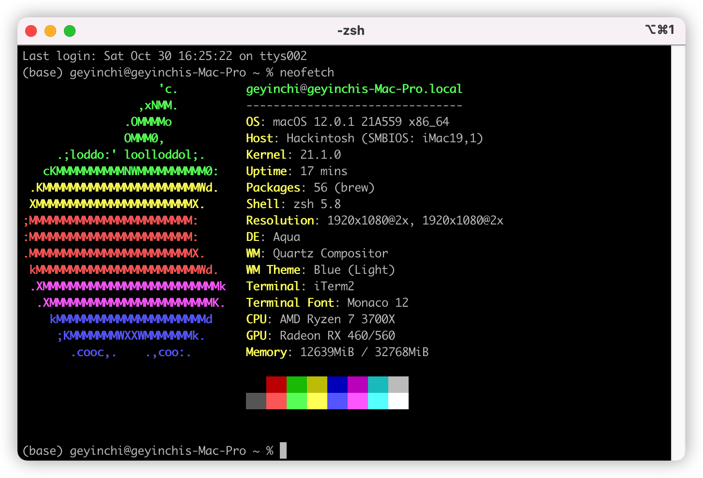

# Asus-B550A-Opencore-EFI
An opencore configuration of hackintosh for ASUS ROG strix B550-A

English | [中文](./README_zh.md)

This configuration runs normally in the following environment:

| Name             | Content                     |
| ---------------- | ----------------------------- |
| CPU              | AMD Ryzen 7 3700X             |
| Motherboard      | ASUS ROG STRIX B550 A         |
| GPU              | Sapphire NITRO RX 460 OC 4 GB |
| Ethernet         | Intel I225-V 2.5Gb            |
| Disk (System)    | WestData SN730 512G(NVME)     |
| Disk (Data)      | Samsung PM981a                |
| WIFI & Bluetooth | Broadcom BCM94360CD           |
| Opencore         | 0.7.4                         |
| Mac OS           | 12.0.1 21A559                 |

##  What works

* Wired Ethernet

  Intel I225-V 2.5Gb is a little bit special for hackintosh, using `FakePCIID.kext` and `FakePCIID_Intel_I225-V.kext` used to be effective, but I found that it may cause random kernel panic after updating to Monterey. [Someone](https://github.com/dortania/bugtracker/issues/213) solved it by overriding `Device Properties -> PciRoot(0x0)/Pci(0x1C,0x1)/Pci(0x0,0x0)  ` to `F2150000`, `F3150000` or `F2158680` on other motherboards with the same Ethernet hardwire, but it doesn't work for me. It was finally solved by [adding a boot args](https://dortania.github.io/OpenCore-Install-Guide/config.plist/comet-lake.html#nvram) `dk.e1000=0`.

* WIFI & Bluetooth

  With the Broadcom wireless card, wifi works fine automatically, but bluetooth needs to be fixed in Monterey. Fixed by adding `BrcmPatchRAM3.kext`, `BrcmFirmwareData.kext` and `BlueToolFixup.kext`, which can be found [here](https://github.com/acidanthera/BrcmPatchRAM).

  Now Airdrop and Handoff both work normally.

  If you are using Intel wireless card, [itlwm](https://github.com/OpenIntelWireless/itlwm) may be useful.

* Kernel patch

  kernel patches are updated according to [Vanilla's newest guide](https://github.com/AMD-OSX/AMD_Vanilla). 

  > Notice: MacOS Monterey installation requires `Misc -> Security -> SecureBootModel` to be disabled in the config. Also TPM needs to be disabled in the BIOS. Both can be enabled after install.

## TL; DR

* Check your CPU, you should edit the kernel patch if the core num of your CPU is not `8`. See [Vanilla's newest guide](https://github.com/AMD-OSX/AMD_Vanilla). 

* If everthing goes ok, remove `-v` argument to disable the logs when booting.

