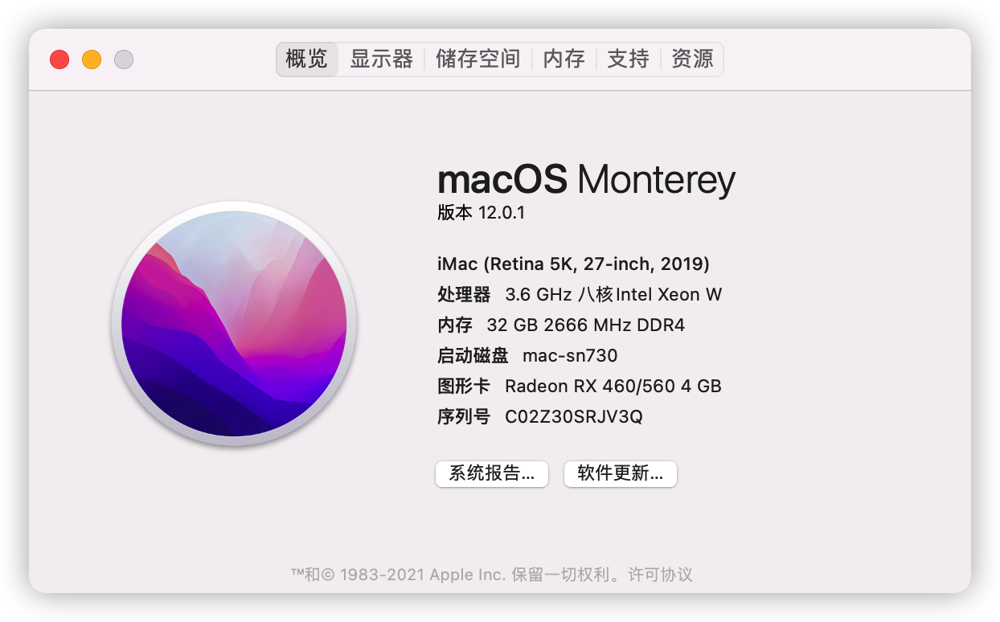

# Asus-B550A-Opencore-EFI
适用于华硕 ROG strix B550-A 主板的Opencore配置文件

[English](./README.md) | 中文

该配置文件在下述环境中运行正常:

| 名称            | 内容                     |
| ---------------- | ----------------------------- |
| CPU              | AMD Ryzen 7 3700X             |
| 主板      | 华硕 ROG STRIX B550 A         |
| 显卡              | 蓝宝石 超白金 RX 460 OC 4 GB |
| 有线网卡         | Intel I225-V 2.5Gb            |
| 硬盘 (系统盘)    | 西数 SN730 512G(NVME)     |
| 硬盘 (从盘)      | 三星 PM981a                |
| WIFI和蓝牙 | 博通 BCM94360CD           |
| Opencore         | 0.7.4                         |
| Mac OS           | 12.0.1 21A559                 |

##  正常运行

* 有线网卡

  Intel I225-V 2.5Gb对于黑苹果来说有些特殊，在过去的版本中可以使用 `FakePCIID.kext` 和 `FakePCIID_Intel_I225-V.kext` 进行驱动，但在升级到MacOS 12 Monterey后会导致随机的内核崩溃（kenerl panic）. [有人](https://github.com/dortania/bugtracker/issues/213) 通过修改 `Device Properties -> PciRoot(0x0)/Pci(0x1C,0x1)/Pci(0x0,0x0)  ` 配置项为 `F2150000`, `F3150000` 或 `F2158680` 在其他带有相同网卡的主板上修复了这个问题，但在我的B550-A上并不生效. 最后通过[增加启动参数](https://dortania.github.io/OpenCore-Install-Guide/config.plist/comet-lake.html#nvram) `dk.e1000=0`解决该问题.

* WIFI和蓝牙

  由于使用了博通无线网卡，WIFI可以自动正常运行，但在macOS 12 Monterey中需要对蓝牙进行修复。本配置增加了 `BrcmPatchRAM3.kext`, `BrcmFirmwareData.kext` 和`BlueToolFixup.kext`三个驱动, 可以在[这里](https://github.com/acidanthera/BrcmPatchRAM)找到.

  隔空投送和接力都可以正常使用。

  如果你使用的是英特尔的无线网卡，可以使用[itlwm](https://github.com/OpenIntelWireless/itlwm).

* 内核补丁

  根据 [Vanilla 最新的文档](https://github.com/AMD-OSX/AMD_Vanilla)更新了内核补丁. 

  > 注意: 安装MacOS 12 Monterey需要将 `Misc -> Security -> SecureBootModel` to 设置为`Disabled`. BIOS中的TPM开关同样需要关闭. 安装完成后都可以重新打开.

## 太长不看

* 你需要根据你的CPU核数来修改内核补丁，可以去参考 [Vanilla 最新的文档](https://github.com/AMD-OSX/AMD_Vanilla)，非常简单. 如果你也是八核CPU，可以直接使用。

* 如果安装完成并一切正常，可以去掉`boot-args`中的`-v`参数。
* 其他细节和问题可以去看[Dortania](https://dortania.github.io/OpenCore-Install-Guide/)。

